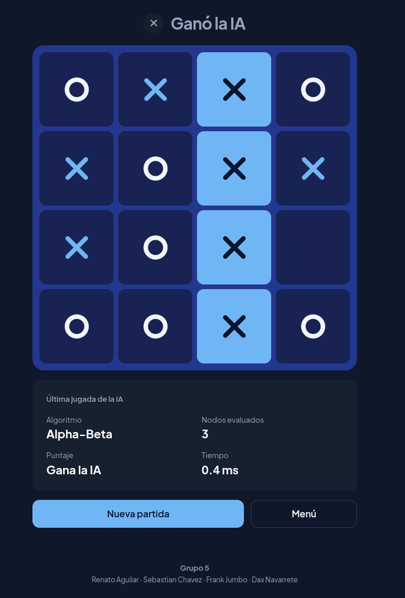

# Tic-Tac-Toe with AI — Minimax and Alpha-Beta Pruning

Tic-Tac-Toe game with **3×3 and 4×4** boards and an AI based on adversarial
search. Academic Artificial Intelligence project — EPN.


The AI plays as **MAX** (maximizing its score) against the human, who acts as
**MIN**. For large trees the search is depth-limited and, once the limit is
reached, evaluates the board with a heuristic function.

<p align="center">
  
</p>

---

## Features

- **Two board sizes:** 3×3 and 4×4 — the rules and the AI derive the size from
  the board itself, so they work the same for both.
- **Two game modes:** Human vs Human and Human vs AI.
- **Three algorithms:** Minimax, Minimax with Alpha-Beta pruning, and a
  comparison mode that runs both on the same state.
- **Live metrics:** nodes evaluated, score, and computation time.
- **Depth-limited search** (1 to 6) with a heuristic for non-terminal states.
- **Winning-line highlight** when the game ends.

---

## Repository structure

The project has three independent parts:

| Folder       | What it is                       | Stack                          |
|--------------|----------------------------------|--------------------------------|
| `project/`   | Original console version         | Python                         |
| `backend/`   | REST API exposing game and AI    | FastAPI · Pydantic             |
| `frontend/`  | Web interface                    | Vite · React 19 · TypeScript   |

```
gato-4x4-minimax/
├── project/      # Console version (original core, untouched)
├── backend/      # REST API  →  see backend/README.md
├── frontend/     # Web interface  →  see frontend/README.md
└── docker-compose.yml
```

`backend/` is an adapted copy of the core in `project/src/game/` (consistent
imports, type hints, no console coupling). The original module is left
untouched. The rules logic lives **only in the backend**: the frontend never
reimplements it, avoiding two sources of truth.

---

## Quick start

The simplest way to run the full game (API + web) is with Docker:

```bash
docker compose up --build
```

Then open **http://localhost:5173**.

To point at different URLs in a deployment, export the variables first:

```bash
VITE_API_URL=https://api.mydomain.com
CORS_ORIGINS=https://gato.mydomain.com
```

---

## Local development

Each module runs separately. Full details in each README.

**Backend** — requires Python 3.11+:

```bash
cd backend
python3 -m venv .venv && source .venv/bin/activate
pip install -r requirements-dev.txt
uvicorn app.main:app --reload
```

API at http://localhost:8000 · Swagger at http://localhost:8000/api/docs

**Frontend** — requires Node.js 20+:

```bash
cd frontend
npm install
npm run dev
```

Web at http://localhost:5173 (needs the backend running).

→ [`backend/README.md`](backend/README.md) · [`frontend/README.md`](frontend/README.md)

---

## Console version

The original version lives in `project/` and is played in the terminal with a
five-option menu: Human vs Human, AI with Minimax, AI with Alpha-Beta,
comparison mode, and exit.

```bash
cd project
python3 -m src.game.main
```

---

## The AI

The project applies the classic adversarial-search concepts:

| Concept             | Implementation                                                |
|---------------------|---------------------------------------------------------------|
| States and actions  | Immutable `GameState`; legal moves = empty cells.             |
| Terminal states     | There is a winner or the board is full.                       |
| Utility function    | Win `+100000`, loss `-100000`, draw `0`.                      |
| Minimax             | Explores the tree assuming optimal play from both sides.      |
| Alpha-Beta pruning  | Discards irrelevant branches; same result, fewer nodes.       |
| Heuristic           | Sums the value of each line when the limit is reached.        |
| Depth-limited search| Depth from 1 to 6 (3 by default).                             |

**Heuristic:** each line (row, column, or diagonal) is worth `10ⁿ` based on the
AI's marks, and `−10ⁿ` based on the opponent's. A mixed line helps no one and is
worth `0`. The board score is the sum of all its lines.

**Empty board:** a full search from scratch is intractable, so the AI opens with
a random move (same criterion as the console version).

**Comparison:** both algorithms pick the same optimal move. The comparison mode
measures the difference in **nodes evaluated** — concrete proof that Alpha-Beta
pruning does the same work while exploring less.

---

## REST API

The API is **stateless**: every request carries the full board. There is no
database and no sessions.

| Method | Route             | Description                                       |
|--------|-------------------|---------------------------------------------------|
| GET    | `/api/health`     | Service status.                                   |
| POST   | `/api/games/new`  | Initial state of a game (`size`: 3 or 4).         |
| POST   | `/api/moves`      | Applies a move (422 if illegal).                  |
| POST   | `/api/ai/move`    | AI move with metrics.                             |
| POST   | `/api/ai/compare` | Compares Minimax vs Alpha-Beta on the state.      |

Full contract and parameters in [`backend/README.md`](backend/README.md) or in
the interactive Swagger documentation.

---

## Tests

```bash
cd backend  && pytest      # 60 tests: rules, AI, and API
cd frontend && npm test    # state reducer tests (Vitest)
```

---

## Team

**Group 5** — Artificial Intelligence, EPN

- Renato Aguilar
- Sebastián Chávez
- Frank Jumbo
- Dax Navarrete

---

## License

[MIT](LICENSE)
